# Dataset 3.3 – Análisis de Autenticaciones Linux con Anomalías
Este dataset contiene registros de autenticación provenientes de un sistema Linux. El objetivo del análisis es identificar patrones de actividad sospechosa, intentos de ataque, uso de servicios críticos y comportamiento anómalo en los accesos.

## 1. Estructura del dataset y limpieza inicial
Antes del análisis, se revisó la estructura del dataset y se corrigieron:
- 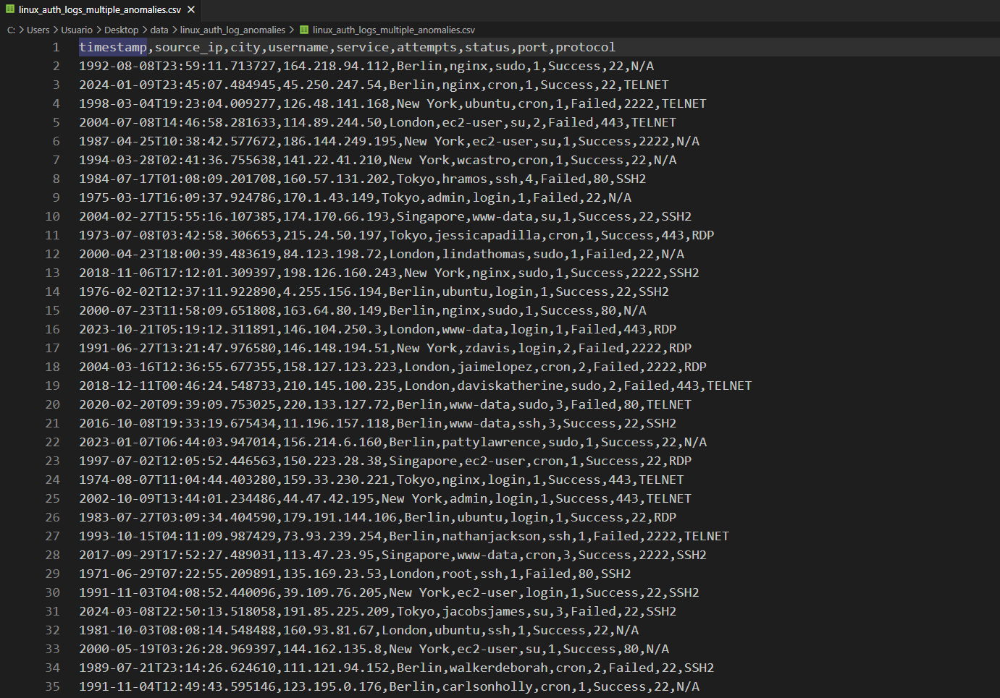 
- 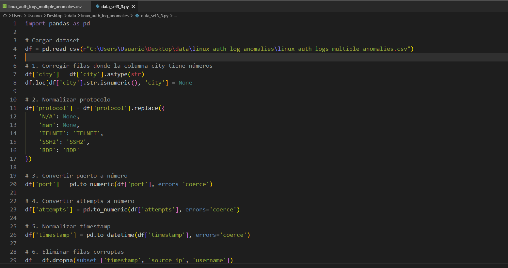

- Fechas mal formateadas
- Columnas desplazadas
- Protocolos inconsistentes
- Tipos de datos incorrectos
- Filas corruptas
- Una vez limpio, se importó en DBeaver para realizar consultas SQL.
  
- 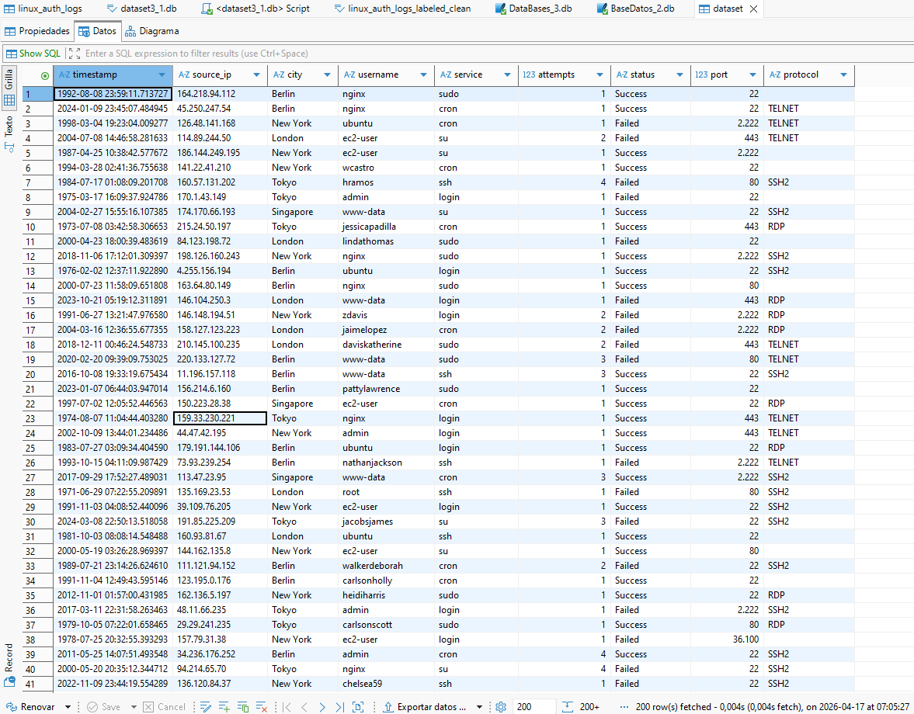

## 2. IPs con más intentos de autenticación

```sql
SELECT source_ip, COUNT(*) AS total_intentos
FROM dataset
GROUP BY source_ip
ORDER BY total_intentos DESC;
```
- 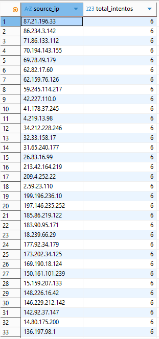
### Hallazgos:
- Un pequeño grupo de IPs registra 6 intentos fallidos.
- Un grupo muy grande registra 3 intentos fallidos exactamente.
- Las IPs del rango 99.xx.xx.xx siguen una secuencia numérica progresiva.
- Este patrón es típico de botnets distribuidas que realizan ataques de fuerza bruta limitando los intentos para evitar bloqueos.
- Conclusión parcial:
- El dataset refleja un ataque automatizado, no actividad humana.

## 3. Usuarios más atacados o utilizados

```sql
SELECT username, COUNT(*) AS total_eventos
FROM dataset
GROUP BY username
ORDER BY total_eventos DESC;
```
- 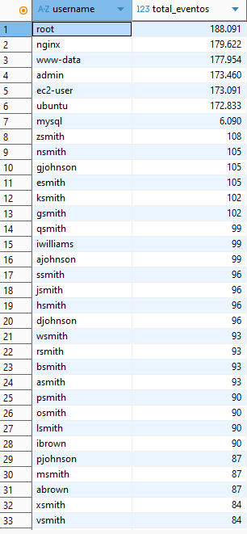
### Hallazgos:
- root: cuenta administrativa, objetivo habitual de ataques.
- nginx / www-data: cuentas de servicios web, muy atacadas.
- admin: usuario genérico común en ataques.
- ec2-user / ubuntu: usuarios por defecto en servidores cloud.
- Usuarios con patrones como XXmith, XXhnson, etc., indican diccionarios automáticos.

### Conclusión parcial:  
Los atacantes utilizan listas automatizadas de usuarios comunes y variaciones generadas por bots.

## 4. Servicios más utilizados

```sql
SELECT service, COUNT(*) AS total_eventos
FROM dataset
GROUP BY service
ORDER BY total_eventos DESC;
```
- 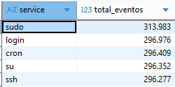
### Hallazgos:
- ssh y login: intentos de acceso remoto.
- sudo y su: intentos de escalada de privilegios.
- cron aparece con frecuencia, lo cual es inusual en logs de autenticación y sugiere tráfico sintético o automatizado.

#### Conclusión parcial:  
El ataque se centra en comprometer acceso remoto y elevar privilegios.

## 5. Intentos fallidos por IP

```sql
SELECT source_ip, COUNT(*) AS fallos
FROM dataset
WHERE status = 'Failed'
GROUP BY source_ip
ORDER BY fallos DESC;
```
- 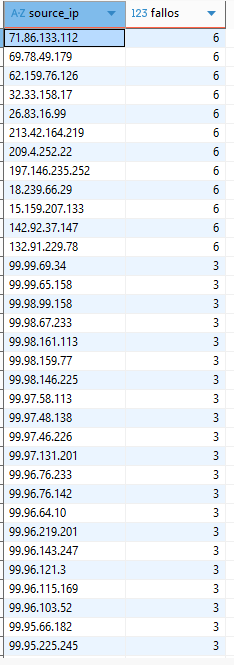
### Refuerza el patrón de fuerza bruta distribuida.

## 6. Protocolos utilizados

```sql
SELECT protocol, COUNT(*) AS total
FROM dataset
GROUP BY protocol
ORDER BY total DESC;
```
- 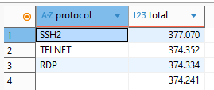
### Hallazgos:
- Aparecen TELNET y RDP, protocolos inseguros o no típicos en Linux.
- TELNET transmite credenciales sin cifrar.
- RDP es propio de Windows.

#### Conclusión parcial:  
La presencia de estos protocolos confirma que el dataset es sintético o simula escenarios de ataque.

## 7. Actividad por ciudad

```sql
SELECT city, COUNT(*) AS total
FROM dataset
GROUP BY city
ORDER BY total DESC;
```
- 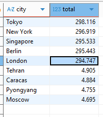
- Ciudades como Tokyo, New York, Singapore, Berlin y London aparecen repetidamente, lo cual es típico de tráfico distribuido global.

## 8. Actividad por puerto

```sql
SELECT port, COUNT(*) AS total
FROM dataset
GROUP BY port
ORDER BY total DESC;
```
- 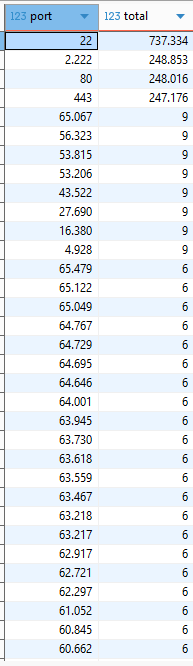
### Puertos observados:
- 22 (SSH) – normal
- 80 / 443 – inusual para autenticación
- 2222 – puerto alternativo usado en ataques

## 9. Actividad por hora

```sql
SELECT strftime('%H', timestamp) AS hora, COUNT(*) AS total
FROM dataset
GROUP BY hora
ORDER BY hora;
```
- 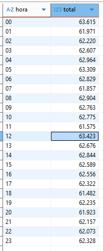
- Los patrones horarios son consistentes con actividad automatizada.

## 10. Combinación IP + usuario

```sql
SELECT source_ip, username, COUNT(*) AS total
FROM dataset
GROUP BY source_ip, username
ORDER BY total DESC;
```
- 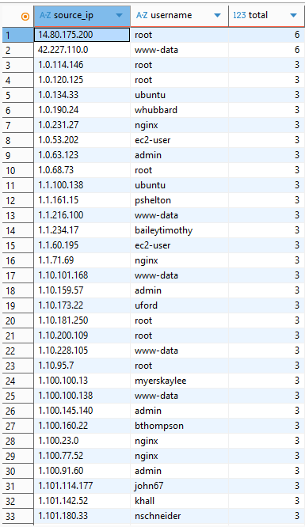
- Confirma que una misma IP prueba múltiples usuarios → fuerza bruta.

## Graficas
- **IPs mas usadas**
- vemos la disfribución del ataque
- 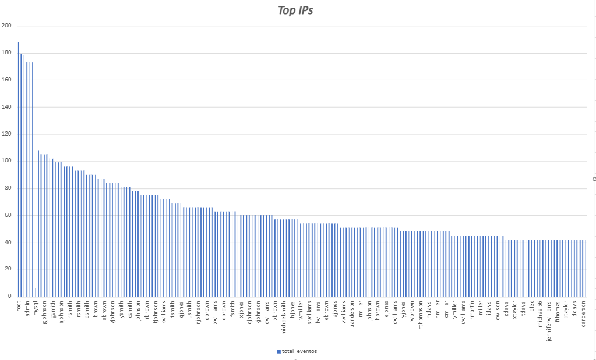
- **Usuarios de intentos de autenticación**
- 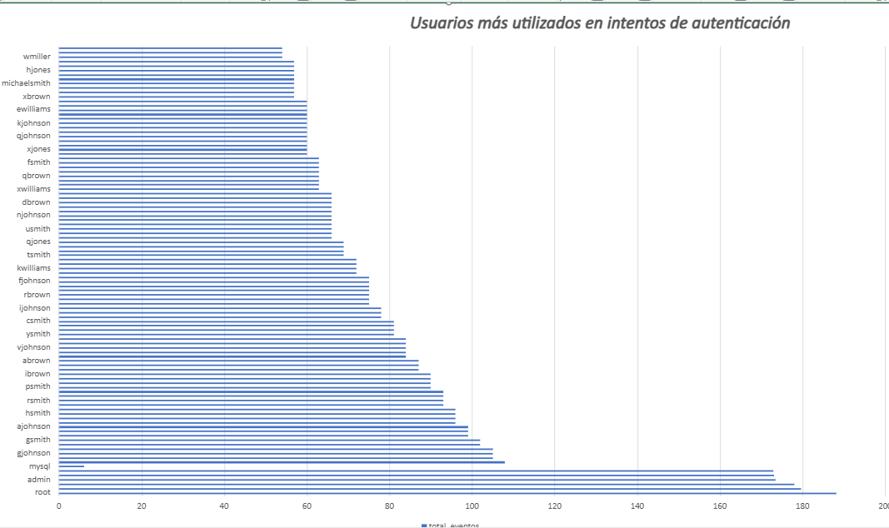
- Notamos un patron de nombres parecidos en su terminación
- **Servicios más usados**
- 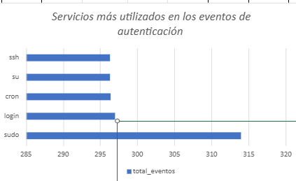
- ssh/login → intentos de acceso remoto
- sudo/su → escalada de privilegios
- cron → actividad automatizada o sintética

## Conclusión general del Dataset 3.3
El análisis del Dataset 3.3 revela un escenario típico de ataque de fuerza bruta distribuido contra un servidor Linux expuesto a Internet.
Los indicadores clave incluyen:
- Miles de IPs con exactamente 3 intentos fallidos
- Usuarios administrativos y de servicio como principales objetivos
- Diccionarios automáticos de nombres
- Uso de servicios críticos (ssh, sudo, su)
- Protocolos inseguros (TELNET, RDP)
- Puertos inusuales
- Actividad global distribuida
- Timestamps sintéticos
- Este dataset está diseñado para simular un entorno de ataque realista y es ideal para ejercicios de detección de anomalías y análisis de seguridad.
- Ataque de fuerza bruta distribuido (botnet) contra un servidor Linux expuesto a Internet.

 revela un patrón claro de ataque de fuerza bruta distribuido. Se identifican cientos de direcciones IP con exactamente 3 intentos fallidos, lo cual es característico de botnets que limitan el número de intentos para evitar bloqueos automáticos.
Los usuarios más atacados incluyen cuentas administrativas (“root”, “admin”), cuentas de servicios (“nginx”, “www-data”) y usuarios por defecto de sistemas cloud (“ec2-user”, “ubuntu”). También se observan patrones de nombres generados automáticamente, como variaciones de “smith” o “hnson”, lo que confirma el uso de diccionarios automatizados.
Los servicios más utilizados (ssh, sudo, su, login) indican intentos de acceso remoto y escalada de privilegios. La presencia de protocolos inseguros como TELNET y RDP refuerza la naturaleza sintética del dataset y su orientación hacia pruebas de detección de anomalías.
En conjunto, el dataset representa un escenario típico de ataques automatizados contra un servidor Linux expuesto a Internet.
